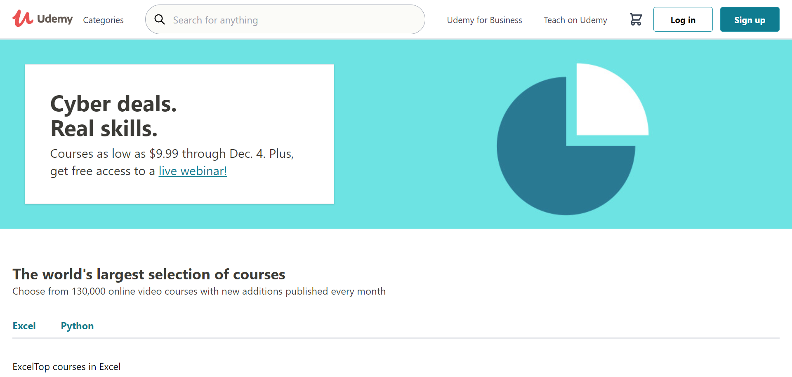

## Udemy Clone

This react project is where I practice my newly acquired react skills. I am building a clone of Udemy.com's frontend. Content is provided by the [Udemy Affiliate API](https://www.udemy.com/developers/affiliate). Feel free to [contribute](./.github/CONTRIBUTION_GUIDE.md) if you're also learning React and looking to experiment with it!

### Project Setup
This project's setup was inspired by Brian Holt's course on [React v5 at Frontend Masters](https://frontendmasters.com/courses/complete-react-v5/).

#### Tooling:
- [Parcel](https://github.com/parcel-bundler/parcel) for bundling. 
- [Axios](https://github.com/axios/axios) for ajax requests.
- [TailwindCSS](https://github.com/tailwindlabs/tailwindcss) for styling
- [Eslint](https://github.com/eslint/eslint)
- [Prettier](https://github.com/prettier/prettier)

#### Run locally:
- Clone this repo
- Run `cd udemy-clone`
- Run `npm install` to install dependencies
- Run `npm run dev`
- Visit <http://localhost:1234> in the browser

### Contribute
Contributions are welcomed! It's always fun learning together so please feel free to fork the repo and send in your PR. Also read the contribution guide for a little update on how to make your contributions!

### Developer
This project was developed by [Samuel Olaegbe](mailto:olaegbesamuel@gmail.com). Twitter [@devloader](https://twitter.com/devloader). Give the repo a star ⭐ to increase visibility :)
